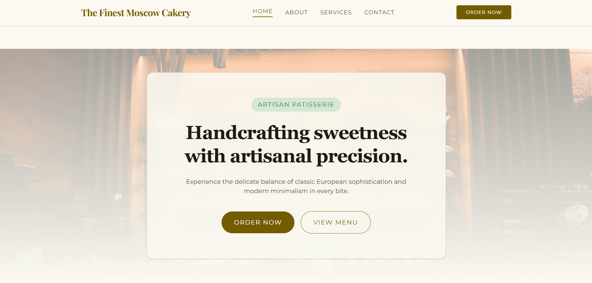
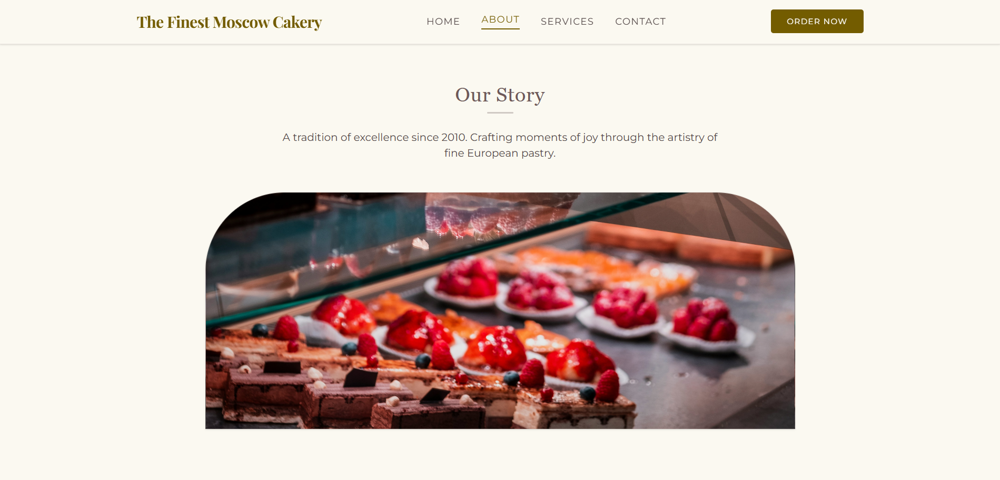
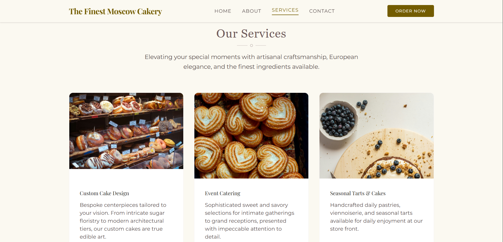
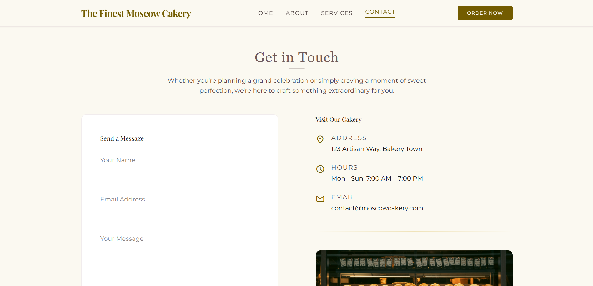

# Company Profile Website - The Finest Moscow Cakery

## 1. Introduction
A company profile website serves as a primary digital presence for modern businesses, establishing brand identity, displaying services, and allowing prospective clients to easily communicate with the brand. For culinary establishments like custom bakeries, an intuitive and accessible web presence builds trust and showcases product offerings visually. This project involves constructing a dynamic, multi-page company profile website for "The Finest Moscow Cakery" to provide users with seamless access to brand details, product selections, and inquiry channels.

## 2. Objectives
* Implement dynamic web routing and controller logic using the Laravel framework.
* Apply the Model-View-Controller (MVC) architectural pattern to enforce separation of concerns across the application.
* Utilize the Blade templating engine to create reusable component layouts, footers, and navigation elements.

## 3. MVC Architecture
The Model-View-Controller (MVC) pattern is a software architectural design that separates application logic into three interconnected components:
* **Model**: Manages data structure, logic, and database operations.
* **View**: Handles the user interface and presentation layer.
* **Controller**: Processes incoming HTTP requests, retrieves required data, and returns the appropriate view.

Laravel adopts MVC to encourage modularity, maintainability, and clean code organization. Request data moves from the user's browser, through routes to the controller, and resolves into a structured View output for the client.

## 4. Laravel Routing
Laravel routing maps incoming URL requests to specific controller actions or closure functions. Utilizing named routes simplifies link generation across Blade views and prevents broken hyperlinks if URL patterns change in the future. All application endpoints handle HTTP `GET` requests to display static and dynamic pages efficiently.

## 5. Controllers
Controllers organize application logic by grouping related request handling into dedicated methods within a single class file. In this project, `CompanyController.php` acts as the primary handler, containing methods that return views for the Home, About, Services, and Contact pages while passing necessary data arrays to the view templates.

## 6. Blade Templating Engine
Laravel’s Blade templating engine allows developers to write clean HTML enhanced with concise control structures. Blade layouts enable master layout definitions through `@extends` and `@yield` directives, ensuring uniform styling across pages. Reusable UI elements, such as navigation bars and footers, are incorporated cleanly via `@include` and custom Blade components.

## 7. Laravel Folder Structure
* `app/`: Contains core application code, including Http Controllers, Models, and Middleware.
* `routes/`: Defines all web and API endpoint definitions, including `web.php`.
* `resources/`: Holds presentation assets, including Blade views, CSS, JavaScript, and translation files.
* `public/`: Serves as the web root, containing front controller `index.php` and public assets like images and styles.
* `bootstrap/`: Contains framework boot scripts, configuration initialization, and cache files.
* `config/`: Holds framework configuration files for database settings, mail, app settings, and third-party services.

## 8. Screenshots
### Home Page

### About Page

### Services Page

### Contact Page

## 9. Problems Encountered
1. **Blade Syntax Directive Error**: Encountered layout rendering errors due to mismatched `@section` and `@endsection` tags in view templates.
2. **Missing Named Route Errors**: Received `RouteNotDefinedException` when navigating between page components using named route helpers.
3. **Asset Image Path Resolution**: Image sources failed to load properly when switching between relative paths across different routes.

## 10. Solutions
1. **Blade Syntax Fix**: Audited all Blade templates to ensure every `@extends` block correctly opened and closed its designated `@yield` targets.
2. **Route Name Alignment**: Defined explicit route names using the `->name()` method within `routes/web.php` for all application paths.
3. **Asset Helper Implementation**: Wrapped image source links in Laravel’s global `asset()` helper function to ensure absolute pathing from the public folder.

## 11. Reflection
Understanding and implementing the Model-View-Controller (MVC) architecture through Laravel provided valuable insight into structured web application design. Prior to working with MVC, combining page structure, backend logic, and styling within single files frequently led to messy codebases that were difficult to debug or expand. Decoupling application logic into routes, controllers, and views enforced a strict separation of concerns that made the code significantly cleaner and easier to maintain.

Through this project, the flow of data across client-server interactions became much clearer. When a browser requests a page, the framework routes the request to a controller method, which processes the necessary logic before serving a rendered Blade template back to the user. Leveraging Blade components and master layouts reinforced the importance of writing reusable code, drastically reducing redundancy across multi-page sites. Overall, adopting an MVC framework like Laravel highlights how modern web development relies on clear architectural boundaries to produce maintainable, scalable, and robust applications.

## 12. References
* Laravel. (n.d.). *Laravel Documentation - Routing*. Retrieved from https://laravel.com/docs/routing
* Laravel. (n.d.). *Laravel Documentation - Blade Templates*. Retrieved from https://laravel.com/docs/blade
* Tailwind CSS. (n.d.). *Tailwind CSS Documentation*. Retrieved from https://tailwindcss.com/docs